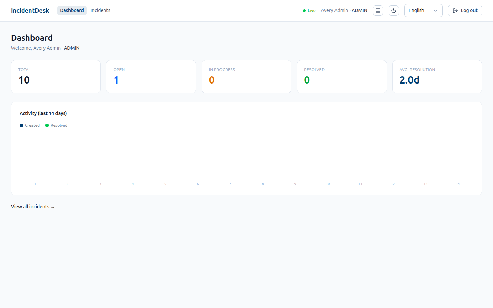
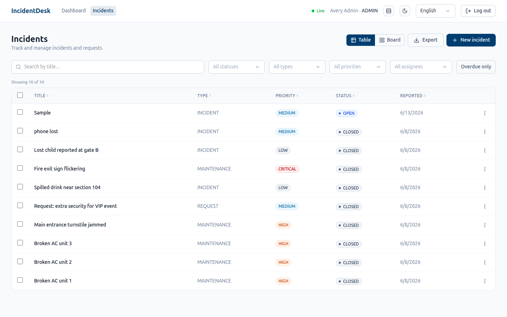

# IncidentDesk


A full-stack incident & request management tracker with role-based access control, built as a production-style demonstration of a modern React + Node + PostgreSQL stack.

> **Live demo:** https://incidentdesk.vercel.app
> **Demo logins:** `admin@incidentdesk.dev / Admin123!` · `reporter@incidentdesk.dev / Reporter123!`
>
> _The API is hosted on a free tier that sleeps when idle — the first request after a pause may take ~30–60s to wake._

## Screenshots

| Dashboard | Incidents |
|---|---|
|  |  |

## Features

- 🔐 **JWT authentication** — self-built, with bcrypt hashing and httpOnly-cookie sessions
- 👥 **Role-based access control** — Admin vs Reporter, enforced in API middleware, service layer, and reporter-scoped queries
- 📋 **Incident management** — create, list, filter, and track incidents and requests
- ⚡ **Optimistic updates** — status/priority changes apply instantly and roll back on error
- 📜 **Audit trail** — every admin change is recorded (who, what, old → new) in a DB transaction
- ♾️ **Cursor pagination** — efficient infinite-scroll list
- 🛡️ **Rate limiting & validation** — throttled auth endpoints, Zod-validated requests

## Tech Stack

| Layer | Technology |
|-------|-----------|
| Frontend | React, TypeScript, Vite, Tailwind CSS, TanStack Query, React Hook Form, Zod |
| Backend | Node, Express, TypeScript, Prisma, JWT, Zod |
| Database | PostgreSQL |
| Tooling | Vitest, Testing Library, GitHub Actions CI, Docker Compose |

## Architecture

```
┌──────────────┐   HTTPS / JSON (httpOnly cookie)   ┌──────────────┐      ┌────────────┐
│   Client     │ ─────────────────────────────────► │   Server     │ ───► │ PostgreSQL │
│ React + Vite │ ◄───────────────────────────────── │ Express API  │      │  (Prisma)  │
└──────────────┘                                     └──────────────┘      └────────────┘

Server: routes → controllers → services → repos → Prisma
        guarded by requireAuth · requireRole · validate · errorHandler
```

## Getting Started

Prerequisites: Node ≥ 22, a PostgreSQL database (e.g. [Neon](https://neon.tech)).

```bash
# 1. Backend
cd server
npm install
cp .env.example .env          # set DATABASE_URL + JWT_SECRET
npm run prisma:migrate
npm run seed
npm run dev                    # http://localhost:4000

# 2. Frontend (new terminal)
cd client
npm install
cp .env.example .env           # VITE_API_URL=http://localhost:4000
npm run dev                    # http://localhost:5173
```

See [`server/README.md`](./server/README.md) and [`client/README.md`](./client/README.md) for details.

## Run with Docker

The whole stack — PostgreSQL, API, and frontend — runs with one command. nginx serves the client and reverse-proxies `/api` to the server (same-origin, no CORS needed):

```bash
docker compose up --build
# → app at http://localhost:8080
```

Migrations run automatically on server startup. Stop with `docker compose down` (add `-v` to also drop the database volume).

## Testing & CI

```bash
cd server && npm test     # Vitest + Supertest (middleware, JWT, schemas, HTTP layer)
cd client && npm test     # Vitest + Testing Library (hooks, components)
```

GitHub Actions runs typecheck, tests, and build for both packages on every push and pull request (see [`.github/workflows/ci.yml`](./.github/workflows/ci.yml)).

## Project Structure

```
incidentdesk/
├── client/   # React + Vite frontend
└── server/   # Express + Prisma API
```

## Future Enhancements

- Real-time updates (WebSockets)
- File attachments on incidents
- Email notifications
- Full-text search

## License

[MIT](./LICENSE) © Yuvaraj Dharmaraj
